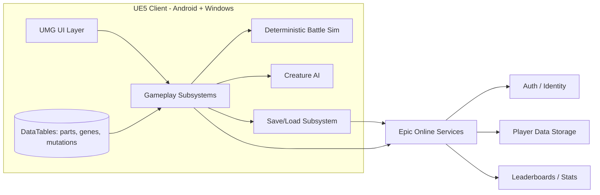

# TechSpec — Technical Specification

> **Purpose:** Defines *how* the product is built — architecture, stack, and the
> key technical decisions behind them.
> **Read it** before designing or changing system structure, adding a service,
> or picking a library.
> **Update it** whenever a technical decision is made or revised.

- **Last updated:** 2026-06-13
- **Related:** `PRD.md` (the *what*), `schema.md` (the data model)

---

## 1. Summary

Evolution Arena is a single-codebase Unreal Engine 5 client targeting **Android
and Windows as co-primary platforms** for V1 (mobile-first UX, scaled to desktop). The game is **data-driven**: creatures are assembled from modular body
parts and a gene array, both defined in DataTables, so new content can ship
without code changes. The core systems (genetics, breeding, mutation, battle
simulation, AI) run as C++ gameplay subsystems for performance and determinism;
UI and glue are UMG/Blueprint. Battles are **deterministic, seed-based
simulations** so the same inputs always produce the same result — this keeps PvP
fair and lets ranked run asynchronously against opponent snapshots ("ghosts").
Online features (auth, cloud save, leaderboards) are delivered through **Epic
Online Services (EOS)** via the Online Subsystem, with a local save as the
source of truth and the cloud as backup/sync.

## 2. Architecture overview

The client owns all gameplay; EOS provides identity, persistence, and
competitive ranking. There is no custom game server in the MVP — ranked is
asynchronous against stored opponent snapshots.

## 3. Tech stack

| Layer | Choice | Notes / why |
|---|---|---|
| Engine | Unreal Engine 5 | Mandated by PRD; strong mobile + Blueprint workflow for a solo dev |
| Gameplay code | C++ (subsystems) | Performance and determinism for genetics/battle |
| UI & glue | UMG + Blueprint | Fast iteration on screens with limited art budget |
| Content / balance | DataTables + Data Assets | Designer-tunable; no recompiles to add creatures/parts |
| Online | EOS via Online Subsystem EOS | Free, cross-account, covers auth + storage + leaderboards |
| Auth | EOS Connect / Epic Account | One identity for cloud save and ranked |
| Cloud save | EOS Player Data Storage | Per-player blob; local save is source of truth |
| Leaderboards | EOS Stats + Leaderboards | Async ranked, MMR/rating as a stat |
| Build target | Android (arm64, Vulkan) **and** Windows (x86-64, D3D12) | Co-primary V1 platforms from one codebase; 60 FPS on mid-range Android |
| Input | Enhanced Input (touch + mouse/keyboard/gamepad) | One action map serves both platforms |
| Analytics | UE Analytics provider (TBD) | Retention/engagement metrics from PRD §6 |

## 4. System components

> One short block per major component: its responsibility and boundaries.

- **Creature Assembly System** — Builds a creature from a genome (gene array +
  part-slot assignments), resolves the final mesh/visual, and computes derived
  stats. Owns the create/preview flow.
- **Genetics System** — Stores genes as allele pairs, resolves dominant/recessive
  expression, and maps expressed genes → stat modifiers. The single authority on
  "what a genome means."
- **Breeding System** — Combines two parent genomes into an offspring genome
  (allele selection per gene), enforces breeding cooldown, and hands off to the
  Mutation System before finalizing.
- **Mutation System** — Rolls mutation chances during breeding, injects rare
  genes/traits, and tags resulting rarity. Reads rates from DataTables.
- **Battle Simulation** — Deterministic, seed-driven tick loop that resolves a
  battle from two creature loadouts and a seed. No rendering dependency; the
  visual layer replays the recorded result.
- **Creature AI** — Per-creature decision logic (utility scoring / behavior tree)
  that the simulation queries each decision point. Pure function of game state +
  creature traits, no wall-clock or RNG outside the seeded stream.
- **Arena & Ranking** — Selects opponents (snapshots/ghosts), submits results,
  and reads/writes rating to EOS leaderboards.
- **Progression System** — Tracks player level, evolution unlocks, and currencies;
  gates content per PRD progression.
- **Save/Load Subsystem** — GameInstance subsystem owning serialization,
  versioning/migration, local persistence, and EOS cloud sync with conflict
  resolution.
- **EOS Integration** — Wraps Online Subsystem calls for auth, storage, and
  leaderboards behind game-facing interfaces.

## 5. Data flow

**Creature creation:** Player selects parts in the Lab → Assembly System builds a
preview genome → Genetics System computes derived stats for live preview →
on confirm, creature is added to the collection and persisted via Save subsystem.

**Breeding → mutation:** Player picks two parents → Breeding System checks
cooldown, then produces an offspring genome by selecting alleles per gene →
Mutation System rolls chances and may inject rare genes → offspring rarity is
computed → result is revealed, added to collection, persisted, cooldown started.

**Ranked battle:** Player enters Arena → Ranking selects an opponent snapshot near
their rating → Battle Simulation runs deterministically from both loadouts + a
seed → result + recorded timeline returned → visual layer replays it → result
submitted to EOS Stats, rating updated, leaderboard refreshed.

## 6. APIs & integrations

> Client ↔ EOS, not a custom REST API. Interfaces are SDK calls.

| Integration | Operation | Purpose | Auth |
|---|---|---|---|
| EOS Auth/Connect | Login / token refresh | Establish player identity | n/a (is auth) |
| EOS Player Data Storage | Read/Write player blob | Cloud save of collection + progress | Yes |
| EOS Stats | Ingest result | Record wins/rating after a battle | Yes |
| EOS Leaderboards | Query rankings | Arena ladder + opponent selection | Yes |
| EOS Title Storage | Read config | Optional remote balance/config (future) | Yes |
| Analytics provider | Emit events | Retention/engagement metrics | Yes |

## 7. Key technical decisions

### Deterministic, seed-based battle simulation

- **Context:** PvP must be fair and ranked should run without a live server (solo
  dev, no custom backend in MVP).
- **Decision:** Battles are pure deterministic simulations driven by a single
  seed; the same loadouts + seed always yield the same outcome.
- **Alternatives considered:** Real-time physics combat (rejected — non-deterministic,
  heavy on mobile, contradicts auto-battler design); authoritative game server
  (rejected for MVP — cost/complexity for a solo dev).
- **Trade-offs:** All balance lives in sim logic; must avoid non-deterministic
  sources (un-seeded RNG, frame-time, float order divergence). Server-side
  re-validation can be added later for anti-cheat.

### EOS for all online features

- **Context:** Need auth, cloud save, and leaderboards cheaply.
- **Decision:** Use Epic Online Services via Online Subsystem EOS.
- **Alternatives considered:** PlayFab / custom backend (more capable but more
  cost/ops); device-local only (no ranked, no sync).
- **Trade-offs:** Tied to EOS feature set and quotas; some features (e.g. rich
  server-validated matchmaking) need custom work later.

### Data-driven content (DataTables + Data Assets)

- **Context:** "Thousands of combinations" from a solo dev with limited art.
- **Decision:** Parts, genes, mutations, and balance values live in DataTables/Data
  Assets; code reads them, never hardcodes balance.
- **Trade-offs:** Requires disciplined schema; tooling/validation needed to keep
  tables consistent.

### Async ranked via opponent snapshots

- **Context:** No live PvP server in MVP, but players want ranked competition.
- **Decision:** Ranked matches run against stored opponent snapshots ("ghosts")
  selected by rating; results update an EOS leaderboard.
- **Trade-offs:** Not live head-to-head; snapshots can go stale. Acceptable for an
  auto-battler where strategy is set before combat.

### Co-primary platforms: Android + Windows

- **Context:** V1 ships on both Android and Windows from a single codebase
  (mobile-first UX, scaled up to desktop). Windows is also the fastest test surface
  while a mid-range Android device is still being sourced.
- **Decision:** Build for Android (arm64, Vulkan) and Windows (x86-64, D3D12) as
  co-primary targets. Input goes through Enhanced Input with one action map serving
  touch, mouse/keyboard, and gamepad. UI is responsive (portrait phone →
  landscape/windowed desktop) and reads from design tokens, not fixed sizes.
- **Cross-architecture determinism (critical):** The seed-based battle sim and
  genetics must produce **identical** results on x86-64 and arm64. Float results can
  diverge across architectures, so: keep the sim integer/fixed-point where practical,
  avoid platform-variant transcendental math in the sim path, compile with
  strict/consistent FP (no fast-math/FMA reordering in sim code), and add a
  cross-platform parity test (same seed → same result on Win64 and Android) to the
  determinism release gate.
- **Trade-offs:** Two scalability profiles and two input paradigms to maintain;
  parity testing across architectures adds CI surface. Accepted — EOS, the
  data-driven content pipeline, and the deterministic-sim design are already
  platform-agnostic, so the marginal cost is mostly input/UI and FP discipline.

### Gene expression & derived-stat model

- **Context:** A genome is inert until something turns genes + parts into stats.
  This computation feeds creation previews, breeding outcomes, and battles, so it
  must be deterministic and cross-platform stable.
- **Decision:** A single pure function (`UGeneticsLibrary::ComputeDerivedStats`)
  computes `DerivedStats = Σ part.StatModifiers + Σ (Stat-gene StatMapping ×
  expressed allele)`, base zero. Each gene's expressed allele is chosen by an
  `EGeneDominance` rule stored in data: Dominant→`Max(A,B)`, Recessive→`Min(A,B)`,
  Codominant→`(A+B)/2`. All math is **integer** (no floats in the genetics path).
  Content lives in DataTables (`FBodyPartDef`/`FGeneDef`, row-name = id).
- **Alternatives considered:** Float weights/curves (rejected — float divergence is
  a cross-arch determinism hazard); hardcoded stat tables in C++ (rejected — breaks
  data-driven balance); a stateful subsystem owning the math (deferred — the pure
  library is trivially testable; a subsystem can cache the DataTables on top later).
- **Trade-offs:** Integer-only keeps the model coarse (no fractional weights) and
  the dominance set is intentionally small for MVP; both are easy to extend in data.

### Local save: USaveGame + atomic write + versioned migration

- **Context:** Player data must persist reliably offline (local is source of truth)
  and survive format changes across builds, all through one subsystem.
- **Decision:** `USaveSubsystem` (a GameInstance subsystem) owns persistence.
  `FPlayerSave` lives inside a `UEvoSaveGame` and serializes via UE's **tagged
  SaveGame archive** (only `SaveGame`-flagged properties; tolerant of added/removed
  fields). Saves are written **atomically** (serialize to bytes → temp file →
  rename over the target). `FPlayerSave.SaveVersion` + `MigrateIfNeeded` provide an
  ordered upgrade path (`CurrentSaveVersion = 1`).
- **Alternatives considered:** Raw `SerializeBin` of the struct (rejected — untagged
  binary can't read old layouts, so no migration); `SaveGameToSlot` directly
  (rejected — less control over atomicity/path, and harder to unit-test headless).
- **Trade-offs:** A non-atomic platform crash between temp-write and rename loses
  only the *new* save, never the existing one. Cloud sync (EOS) and conflict
  resolution layer on top later.

### Deterministic breeding & mutation

- **Context:** Breeding combines two parents into an offspring with random allele
  and mutation outcomes — but it must be reproducible (fair PvP, replayable results)
  and identical across x86-64 and arm64.
- **Decision:** All randomness goes through one `FRandomStream` seeded from an
  explicit `int32`. RNG is drawn while iterating **ordered arrays** (genes/parts),
  and mutation rows are rolled in **lexically-sorted** order (`FName::LexicalLess`,
  not `FastLess`, which varies per run) — so the draw sequence is identical
  everywhere. Mutation chance is **integer per-mille** (`RandRange(0,999) < chance`),
  no floats. Inheritance is Mendelian per locus (one allele from each parent). The
  *genome* is deterministic for a given seed; the creature's GUID/timestamp are not
  (each offspring is a distinct entity).
- **Alternatives considered:** `FMath::Rand`/global RNG (rejected — not seedable/
  deterministic); float probabilities (rejected — cross-arch float divergence);
  `TMap`-based locus matching (rejected — unordered iteration breaks determinism).
- **Trade-offs:** Caller must thread the seed through; stable-order requirement is a
  standing constraint on anyone touching the breed path. Rarity uses a fixed-
  threshold formula (`Σ part rarities + 2×mutations`) — tunable constants that are
  candidates to move to config.

### Battle simulation: deterministic, no render dependency, timeline replay

- **Context:** The auto-battler must resolve fights from creature stats with no
  player input, be reproducible (the determinism release gate / fair ranked), and
  decouple simulation from rendering (sim runs faster than real time; visuals replay).
- **Decision:** `UBattleSimulator::SimulateBattle(A, B, Seed)` runs a 1v1 turn-based
  loop — combatants act in Speed order (ties → index, stable), choosing `Attack` or
  `Heavy` via `UBattleAI`. Damage is integer (`Attack − Defense/2`); `Heavy` hits
  harder but has a seeded per-mille miss chance. A `MaxRounds` cap guarantees
  termination (then decided by remaining health). The sim emits an `FBattleResult`
  with an ordered `FBattleEvent` **timeline**; the playback UI later just animates it.
  One seeded `FRandomStream`, integer-only → identical result on every platform.
- **AI:** deterministic utility — Heavy when it would be lethal on hit, else Attack.
  No RNG in the *decision* (RNG only resolves whether Heavy connects), so behavior is
  reproducible and testable.
- **Alternatives considered:** Real-time/physics combat (rejected — non-deterministic,
  heavy on mobile, contradicts the auto-battler design); float damage/crit math
  (rejected — cross-arch divergence); coupling sim to the render tick (rejected —
  breaks faster-than-real-time replay).
- **Trade-offs:** The combat model is intentionally shallow for MVP (two actions, 1v1,
  mutations don't yet affect stats); damage constants and `MaxRounds`/miss-chance are
  candidates for config. Square the model up as content/AI depth grows.

### Online behind an abstract service; integer ranked rating

- **Context:** Ranked needs rating, opponent selection, and standings — but EOS isn't
  wired (no creds yet), and `rules.md` requires all online access to go through
  wrapper interfaces so the game runs offline in-editor and the backend can be swapped.
- **Decision:** An abstract `ULeaderboardService` (`SubmitResult` / `SelectOpponent` /
  `GetTopEntries`) is the single online boundary. `ULocalLeaderboardService` (in-memory,
  deterministic) backs dev/offline/tests now; the EOS-backed subclass is the *only*
  thing that changes to go live. Ranked is **async vs stored `FOpponentSnapshot`
  ghosts** (matches the async-ranked decision above). Rating is **integer Elo-like**
  (`URankingLibrary`, no floats): `Delta = K·(Score‰ − Expected‰)/1000`. Match
  orchestration (`URankedArenaLibrary::RunRankedMatch`) is pure logic over the interface.
- **Alternatives considered:** Calling EOS directly from gameplay (rejected — violates
  the interface rule, blocks offline/tests); float Elo (rejected — float divergence,
  inconsistent with the integer-only ethos).
- **Trade-offs:** Local selection is simple (closest rating); the rating curve is an MVP
  approximation with tunable constants. The EOS implementation (auth, Stats,
  Leaderboards) is deferred until credentials exist — but the boundary is set, so it
  drops in behind the existing interface.

### Progression & economy: derived level, data-driven unlocks, breeding sink

- **Context:** Ranked results need to *reward* the player and breeding needs to *cost*
  something, forming an earn/spend loop over `FPlayerSave`.
- **Decision:** `UProgressionLibrary` (integer): a ranked result grants XP + soft
  currency (win > loss); **Level is derived** from total `Xp` (`1 + Xp/XpPerLevel`) and
  recomputed on award; unlocks are **data-driven** (`FProgressionUnlockDef` rows keyed
  by unlock id with a `RequiredLevel`) and accumulate on `FPlayerSave.EvolutionUnlocks`.
  The spend side is the **breeding transaction** (`UBreedingLibrary::CanBreed`/`CommitBreed`):
  `BreedCost = 50` deducted, `BreedCooldown = 4h` stamped on both parents. Defaults are
  named constants / config candidates. Resolves the PRD breeding-cooldown question.
- **Alternatives considered:** storing Level independently of XP (rejected — risk of
  drift; derive it); hardcoded unlock rules in C++ (rejected — data-driven balance rule).
- **Trade-offs:** Reward/cost/cooldown numbers are untuned MVP placeholders; the XP
  curve is linear (no soft cap yet); a real max-level/prestige model is future work.

## 8. Non-functional requirements

- **Performance:** 60 FPS on mid-range Android and on Windows desktop, with two
  scalability profiles (mobile Scalable vs desktop). Battle sim must run faster than
  real time so results can be computed then replayed; budget mesh/material counts for
  low-end mobile GPUs.
- **Security:** EOS-managed identity; no secrets in the client repo; client results
  are trusted in MVP (documented risk), with server re-validation as a later
  hardening step.
- **Scalability:** Async design means no concurrent-session load; EOS absorbs
  storage/leaderboard scale.
- **Reliability:** Local save is source of truth with cloud backup; save writes are
  atomic and versioned; sync conflicts resolved by newest-valid-wins + backup copy.
- **Observability:** Analytics events for the PRD success metrics (sessions,
  battles, breeding attempts, ranked participation); structured logging for sim
  determinism checks.

## 9. Risks & mitigations

| Risk | Likelihood | Impact | Mitigation |
|---|---|---|---|
| Non-determinism creeps into battle sim | M | H | Seeded RNG only; fixed-step tick; automation tests asserting reproducibility |
| Float results differ across x86-64 (Win) vs arm64 (Android) | M | H | Integer/fixed-point sim where practical; strict FP, no fast-math/FMA reorder in sim; cross-platform parity test in the determinism gate |
| Client-trusted results enable cheating | M | M | Accept for MVP; add server re-simulation/validation post-MVP |
| Art/content bottleneck (solo dev) | H | M | Modular parts + procedural assembly; reuse meshes via gene-driven variation |
| Mobile perf below 60 FPS | M | H | Strict mesh/material budgets; profile on target devices early |
| EOS quotas/limits hit at scale | L | M | Cache reads; batch stat writes; plan migration path to custom backend |
| Save corruption / sync conflict loss | L | H | Versioned saves, atomic writes, local backup before cloud overwrite |

## 10. Open technical questions

> Carried from PRD §9; resolve before the affected system is finalized.

- [ ] Battles client-side only for MVP, or add server re-validation? (leaning
  client-side MVP, server validation post-MVP)
- [ ] How many mutations and creature parts ship in the MVP DataTables?
- [ ] Breeding cooldown duration and whether it's skippable.
- [ ] Rarity formula — derived from gene rarity, stat sum, or mutation count?
- [ ] Maximum creature level / progression ceiling.
- [ ] Async ranked confirmed as the MVP model (snapshots) — any live element later?
- [ ] Analytics provider selection.
- [ ] Windows RHI: D3D12 (default) vs Vulkan for closest parity with Android — and
  the exact FP/build flags needed to guarantee cross-arch sim determinism.
