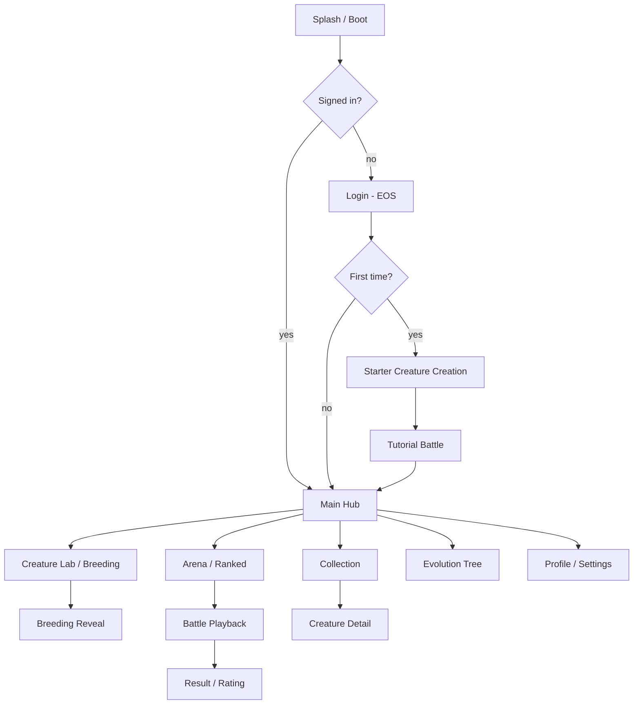

# App Flow

> **Purpose:** Describes how a user moves through the product — journeys,
> screens, states, and navigation.
> **Read it** before building navigation, screens, or flows.
> **Update it** whenever a flow or screen behaviour changes.

- **Last updated:** 2026-06-13
- **Related:** `design.md` (look & feel), `PRD.md` (the features behind flows)

---

## 1. Overview

Evolution Arena is a cross-platform (Android + Windows) game built around a
hub-and-spoke loop — portrait/touch on phone, landscape/windowed with
mouse-keyboard (and gamepad) on Windows desktop. The journeys below are identical
on both.
The four journeys that matter:

1. **First session / onboarding** — sign in, create a starter creature, win a
   tutorial battle.
2. **Breed loop** — pick two creatures, breed, reveal offspring (and any
   mutation), add to collection.
3. **Ranked loop** — pick a loadout, run an auto-battle against a ranked opponent
   snapshot, see rating change.
4. **Collection & progression** — browse owned creatures, inspect genomes, spend
   currency, unlock evolution branches.

These are "screens," not URL routes — navigation is via a persistent bottom nav
bar plus modal flows.

## 2. Navigation map

## 3. Routes / screens

| Screen | Purpose | Auth required |
|---|---|---|
| Splash / Boot | Init engine, load EOS, route to login or hub | No |
| Login (EOS) | Authenticate / create identity | No |
| Starter Creature Creation | Onboarding-only guided first build | Yes |
| Tutorial Battle | Teach the auto-battle loop with a scripted win | Yes |
| Main Hub | Central navigation + daily summary | Yes |
| Creature Lab / Breeding | Build creatures from parts; select parents to breed | Yes |
| Breeding Reveal | Animated offspring + mutation reveal | Yes |
| Collection | Grid of owned creatures, filter/sort | Yes |
| Creature Detail | Genome, stats, lineage, evolution state | Yes |
| Arena / Ranked | Choose loadout, find ranked opponent | Yes |
| Battle Playback | Replay the simulated battle | Yes |
| Result / Rating | Outcome, rating delta, rewards | Yes |
| Evolution Tree | Unlock advanced genetic branches/species | Yes |
| Profile / Settings | Account, rank, audio/graphics, sign out | Yes |

## 4. Key flows

### Flow: First-time onboarding

1. **Entry point:** First launch after install, post-login.
2. **Steps:**
   - Player signs in via EOS → identity established, empty save created.
   - Guided Starter Creature Creation: player picks from a small curated set of
     body parts → Assembly previews stats live → confirm.
   - Starter creature is added to collection and persisted.
   - Tutorial Battle: scripted opponent, guaranteed win, teaches "strategy before
     combat" — player sets the creature, watches the auto-battle, sees the result.
3. **Success:** Player lands on Main Hub owning one creature, having won once.
4. **Branches / alternatives:** Returning player (save exists) skips straight to
   Hub. Login failure → retry / offline notice (see edge cases).
5. **Exit points:** Hub (normal); app background at any step resumes where left.

### Flow: Breeding

1. **Entry point:** Creature Lab → Breed.
2. **Steps:**
   - Player selects two eligible parents (off-cooldown) → system validates.
   - Confirm cost (currency/cooldown) → Breeding System produces offspring genome.
   - Mutation System rolls; rarity computed.
   - Breeding Reveal animates the offspring; mutations are highlighted.
   - Offspring added to collection; parents enter cooldown; save persisted.
3. **Success:** New creature in collection; reveal celebrates rare outcomes.
4. **Branches / alternatives:** Parent on cooldown → blocked with timer; insufficient
   currency → prompt; no second eligible creature → empty-state guidance.

### Flow: Ranked battle

1. **Entry point:** Arena → Ranked.
2. **Steps:**
   - Player selects a creature/loadout → confirm.
   - Ranking picks an opponent snapshot near the player's rating.
   - Battle Simulation runs deterministically (seed + both loadouts).
   - Battle Playback replays the recorded timeline.
   - Result screen shows win/loss, rating delta, rewards; result submitted to EOS.
3. **Success:** Rating updated, leaderboard reflects it, rewards granted.
4. **Branches / alternatives:** No opponent in band → widen search / bot snapshot;
   offline → queue result for later submission (see edge cases).

### Flow: Creature creation (Lab)

1. **Entry point:** Creature Lab → Build.
2. **Steps:** Select part per slot → live stat preview from Genetics System →
   confirm → creature created and saved.
3. **Success:** New creature available in collection.

## 5. Screen states

| Screen | Loading | Empty | Error | Success |
|---|---|---|---|---|
| Main Hub | Skeleton tiles | n/a (always has nav) | Offline banner, cached data | Daily summary + nav |
| Collection | Shimmer grid | "No creatures yet — breed or build one" CTA | Retry load | Filterable grid |
| Creature Lab | Spinner on assemble | "Pick parts to begin" prompt | Invalid combo warning | Live preview + Confirm |
| Breeding Reveal | Reveal animation | n/a | Roll failed → retry/no charge | Offspring shown, rarity flagged |
| Arena | "Finding opponent…" | "No ranked opponents — try later" | Matchmaking error → retry | Opponent found, Start |
| Battle Playback | Buffering replay | n/a | Replay error → show result only | Timeline plays, skippable |
| Result / Rating | Submitting result | n/a | Submit failed → queued offline | Rating delta + rewards |

## 6. Edge cases

- **No network / timeout:** Game stays playable offline against local data; ranked
  results and cloud save are queued and synced on reconnect. Hub shows an offline
  banner.
- **Save conflict (cloud vs local):** Newest-valid save wins; the other is kept as
  a backup. Never silently discard creatures.
- **Breeding on cooldown / insufficient funds:** Action blocked with a clear timer
  or cost prompt rather than failing mid-flow.
- **Empty collection:** Onboarding guarantees one creature; defensive empty-states
  guide the player back to Lab if they somehow have none.
- **Unauthorised / login failure:** Offer retry and an offline mode; never hard-lock
  on the splash screen.
- **Large collection:** Collection grid virtualizes and supports filter/sort so
  hundreds of creatures stay performant.
- **App backgrounded mid-battle:** Battles are simulated up front; on resume the
  result is already known and replay can be skipped to the result.
- **Desktop window resize / input switch:** On Windows the UI reflows on window
  resize and accepts mouse, keyboard, and gamepad interchangeably; no flow assumes
  touch-only gestures.
