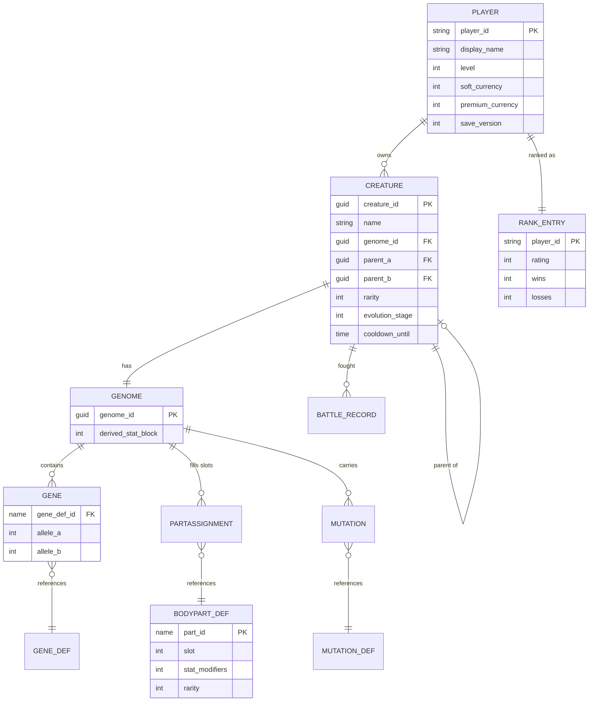

# Schema — Data Model

> **Purpose:** The single source of truth for the data model — entities, fields,
> relationships, and storage. This is a UE5 game, so "tables" here are
> **DataTables, runtime structs, and the persisted SaveGame** rather than SQL
> tables. The competitive leaderboard lives in EOS.
> **Read it** before touching data structures, save data, DataTables, or queries.
> **Update it** whenever a struct, field, relationship, or storage format changes —
> in the same change that touches the code.

- **Last updated:** 2026-06-13
- **Storage:** Local UE5 `SaveGame` (source of truth) + EOS Player Data Storage
  (cloud backup/sync) + EOS Stats/Leaderboards (ranking). Static content in
  DataTables/Data Assets.
- **Related:** `TechSpec.md` (how data fits the system)

---

## 1. Overview

Core nouns: **Player**, **Creature**, and the **Genome** that defines a creature.
A Genome is an array of **Genes** (allele pairs) plus a set of **Body Part**
assignments (one part per slot). Genes and parts reference static definitions in
DataTables. Breeding produces a new Genome from two parents and may apply
**Mutations**. Battles produce **Battle Records**; ranked play writes a
**Rank Entry** to the EOS leaderboard. Everything a player owns is serialized in
the **PlayerSave**.

- **Static (DataTable / Data Asset):** Body Part definitions, Gene definitions,
  Mutation definitions, balance config.
- **Dynamic per-player (SaveGame):** PlayerSave → Creatures → Genomes, currencies,
  progression, breeding cooldowns.
- **Backend (EOS):** Rank/rating stats, leaderboard, opponent snapshots.

## 2. Entity-relationship diagram

## 3. Tables / structs

> One section per entity. UE types are illustrative (`F…` struct, `E…` enum).

### `FPlayerSave` (root SaveGame object)

| Field | Type | Constraints | Default | Notes |
|---|---|---|---|---|
| `PlayerId` | FString | not empty | EOS account id | Identity from EOS |
| `DisplayName` | FString | | "" | Player-chosen name |
| `Level` | int32 | ≥ 1 | 1 | Progression level (derived from `Xp`) |
| `Xp` | int32 | ≥ 0 | 0 | Total accumulated XP (additive field) |
| `SoftCurrency` | int32 | ≥ 0 | 0 | Earned currency |
| `PremiumCurrency` | int32 | ≥ 0 | 0 | Future monetization (not MVP-spent) |
| `RankedRating` | int32 | | 1000 | Elo-like ranked rating (additive field) |
| `Wins` | int32 | ≥ 0 | 0 | Ranked wins |
| `Losses` | int32 | ≥ 0 | 0 | Ranked losses |
| `Creatures` | TArray\<FCreature\> | | [] | Owned collection |
| `EvolutionUnlocks` | TArray\<FName\> | | [] | Unlocked branches/species |
| `SaveVersion` | int32 | ≥ 1 | 1 | Drives migration |
| `LastSavedUtc` | FDateTime | | now | Conflict resolution |

### `FCreature`

| Field | Type | Constraints | Default | Notes |
|---|---|---|---|---|
| `CreatureId` | FGuid | unique | new guid | Stable id |
| `Name` | FString | | generated | Player-editable |
| `Genome` | FGenome | required | | Defines the creature |
| `Rarity` | ERarity | | Common | Derived at creation/breed |
| `EvolutionStage` | int32 | ≥ 0 | 0 | Advances via Evolution Tree |
| `ParentA` | FGuid | nullable | invalid | Lineage (null for built/starter) |
| `ParentB` | FGuid | nullable | invalid | Lineage |
| `BreedCooldownUntil` | FDateTime | | epoch | Off-cooldown when now ≥ value |
| `CreatedUtc` | FDateTime | | now | |

### `FGenome`

| Field | Type | Constraints | Default | Notes |
|---|---|---|---|---|
| `Genes` | TArray\<FGene\> | fixed length per config | | Allele pairs |
| `Parts` | TArray\<FPartAssignment\> | one per slot | | Slot → part id |
| `Mutations` | TArray\<FName\> | | [] | Active mutation def ids |
| `DerivedStats` | FStatBlock | computed | | Cached; recomputed from genes+parts |

### `FGene`

| Field | Type | Constraints | Default | Notes |
|---|---|---|---|---|
| `GeneDefId` | FName | FK → Gene_Def | | Which gene |
| `AlleleA` | uint8 | | | One inherited allele |
| `AlleleB` | uint8 | | | Other inherited allele; dominance resolves expression |

### `FPartAssignment`

| Field | Type | Constraints | Default | Notes |
|---|---|---|---|---|
| `Slot` | EBodyPartSlot | | | Which slot |
| `PartId` | FName | FK → BodyPart_Def | | Assigned part |

### `FBodyPartDef : FTableRowBase` (DataTable row — static, implemented)

The DataTable row's **FName key is the part id** (`FPartAssignment.PartId` references
it) — there is no separate id field on the struct.

| Field | Type | Constraints | Default | Notes |
|---|---|---|---|---|
| `Slot` | EBodyPartSlot | | Head | Which slot this part fills |
| `StatModifiers` | FStatBlock | | zero | Added directly to derived stats |
| `Rarity` | ERarity | | Common | Feeds creature rarity |
| _Mesh/Material refs_ | soft refs | | | Deferred to the Creature Assembly task |

### `FGeneDef : FTableRowBase` (DataTable row — static, implemented)

The row's **FName key is the gene id** (`FGene.GeneDefId` references it). Only
`Type == Stat` genes affect derived stats.

| Field | Type | Constraints | Default | Notes |
|---|---|---|---|---|
| `Type` | EGeneType | | Stat | Stat / Visual / Special |
| `Dominance` | EGeneDominance | | Dominant | How the allele pair is expressed (see §6) |
| `StatMapping` | FStatBlock | | zero | Per-unit stat weight × expressed allele |

### `FMutationDef : FTableRowBase` (DataTable row — static, implemented)

Row's **FName key is the mutation id** (recorded on `FGenome.Mutations` when it hits).

| Field | Type | Constraints | Default | Notes |
|---|---|---|---|---|
| `ChancePermille` | int32 | 0–1000 | 0 | Integer per-mille roll — deterministic, no float |
| `Rarity` | ERarity | | Rare | Mutations skew rare+; feeds rarity calc |
| `Effect` | FStatBlock | | zero | Reserved — stat-affecting mutations (not applied yet) |
| `AffectedType` | EGeneType | | Special | Reserved — target gene category |

### `FProgressionUnlockDef : FTableRowBase` (DataTable row — static, implemented)

Row's **FName key is the unlock id** (added to `FPlayerSave.EvolutionUnlocks` when the
player reaches the level). Content gates by checking that set.

| Field | Type | Constraints | Default | Notes |
|---|---|---|---|---|
| `RequiredLevel` | int32 | ≥ 1 | 1 | Player level at which the unlock is granted |

### `FBattleResult` / `FBattleEvent` / `FBattleCombatant` (runtime, implemented)

The battle sim is pure logic with no rendering dependency: it returns an
`FBattleResult` (outcome + a `TArray<FBattleEvent>` **timeline** the later playback UI
animates). `FBattleCombatant` is the in-sim state (built from `Genome.DerivedStats`).

**`FBattleResult`** — `EBattleOutcome Outcome`, `int32 Rounds`, `FinalHealthA/B`,
`int32 Seed`, `TArray<FBattleEvent> Timeline`.
**`FBattleEvent`** — `int32 Round`, `int32 ActorIndex` (0=A,1=B), `EBattleAction
Action`, `bool bMissed`, `int32 Damage`, `int32 TargetHealthAfter`.
**`FBattleCombatant`** — `FGuid CreatureId`, `FStatBlock Stats`, `int32 CurrentHealth`.

### `FBattleRecord` (Phase 4 — for ranked submission, not yet built)

| Field | Type | Constraints | Default | Notes |
|---|---|---|---|---|
| `Seed` | int32 | | | Reproduces the sim (matches `FBattleResult.Seed`) |
| `PlayerCreatureId` | FGuid | | | Loadout used |
| `OpponentSnapshotId` | FString | | | EOS snapshot ref |
| `Outcome` | EBattleOutcome | | | CombatantAWon / CombatantBWon / Draw |
| `RatingDelta` | int32 | | | Applied to rank |

### `FOpponentSnapshot` / `FRankEntry` (Online, implemented)

Served through the abstract `ULeaderboardService` (local impl now; EOS impl later).
A **snapshot** is a stored opponent ("ghost") the player battles asynchronously.

**`FOpponentSnapshot`** — `FString PlayerId`, `int32 Rating`, `FCreature Loadout`.
**`FRankEntry`** (one leaderboard standing) — `FString PlayerId`, `int32 Rating`
(sort key), `int32 Wins`, `int32 Losses`.

> The EOS-backed implementation maps these to EOS Stats/Leaderboards; the local
> implementation keeps them in memory. Gameplay code only sees the structs + interface.

## 4. Relationships

- `FCreature.Genome` → owns one `FGenome` (composition; 1:1).
- `FGenome.Genes[*].GeneDefId` → `Gene_Def.GeneId` (many genes reference one def).
- `FGenome.Parts[*].PartId` → `BodyPart_Def.PartId` (one part per slot).
- `FGenome.Mutations[*]` → `Mutation_Def.MutationId`.
- `FCreature.ParentA/ParentB` → `FCreature.CreatureId` (lineage; nullable for
  built/starter creatures; on parent deletion, keep child — store lineage by id,
  tolerate dangling).
- `FPlayerSave.Creatures` → owns many `FCreature` (composition; delete cascades).
- `RankEntry.PlayerId` → `FPlayerSave.PlayerId` (EOS side, 1:1 per player).

## 5. Indexes / lookup keys

> No SQL indexes; these are the keys that matter for lookups and sorting.

| Where | Key | Purpose |
|---|---|---|
| DataTables | Row `FName` (PartId/GeneId/MutationId) | O(1) static lookup at load |
| Collection | `CreatureId` (FGuid) | Stable reference across sessions |
| EOS Leaderboard | `Rating` (sort), `PlayerId` (lookup) | Ranking + opponent selection band |
| Save sync | `LastSavedUtc` + `SaveVersion` | Conflict resolution |

## 6. Enums & lookup values

- `ERarity`: Common, Uncommon, Rare, Epic, Legendary
- `EBodyPartSlot`: Head, Torso, Limbs, Tail, Special *(MVP set — finalize count
  per PRD open question)*
- `EGeneType`: Stat, Visual, Special
- `EGeneDominance`: Dominant (express `Max` allele), Recessive (`Min`), Codominant
  (`(A+B)/2`). Derived stats = `Σ part.StatModifiers + Σ (Stat-gene StatMapping ×
  expressed allele)`; base stats are **zero** (parts supply the baseline).
- `ECreatureStat`: Health, Attack, Defense, Speed — the stat axes (`FStatBlock`
  carries one `int32` per axis). *Named `ECreatureStat`, not `EStatType`, because
  the engine reserves `EStatType` in Core. Extend as balance requires.*
- `EBattleAction`: Attack, Heavy *(combatant action; expand for special abilities)*
- `EBattleOutcome`: CombatantAWon, CombatantBWon, Draw
- `EArenaType`: Casual, Ranked *(squad/environment modifiers are post-MVP)*

## 7. Migrations / versioning

- **Tool:** UE `SaveGame` serialization with an explicit `SaveVersion` integer.
- **Convention:** Bump `SaveVersion` on any breaking change to `FPlayerSave` or
  nested structs; the Save/Load subsystem runs ordered upgrade steps from the
  saved version to current on load.
- **Implemented (2026-06-14):** `USaveSubsystem` owns persistence; `UEvoSaveGame`
  wraps `FPlayerSave` and serializes via the tagged SaveGame archive (resilient to
  added/removed fields). Writes are atomic (temp file → rename). `MigrateIfNeeded`
  is the per-version upgrade hook (`CurrentSaveVersion = 1`). Local file is the
  source of truth; EOS cloud sync layers on later.
- **Notes:**
  - DataTable schema changes that drop/rename `FName` keys must include a remap so
    existing creatures don't lose parts/genes.
  - Cloud sync compares `SaveVersion` + `LastSavedUtc`; never overwrite a newer
    valid save — back it up first.
  - Seed starter content (curated parts/genes for onboarding) lives in DataTables,
    not in code.
